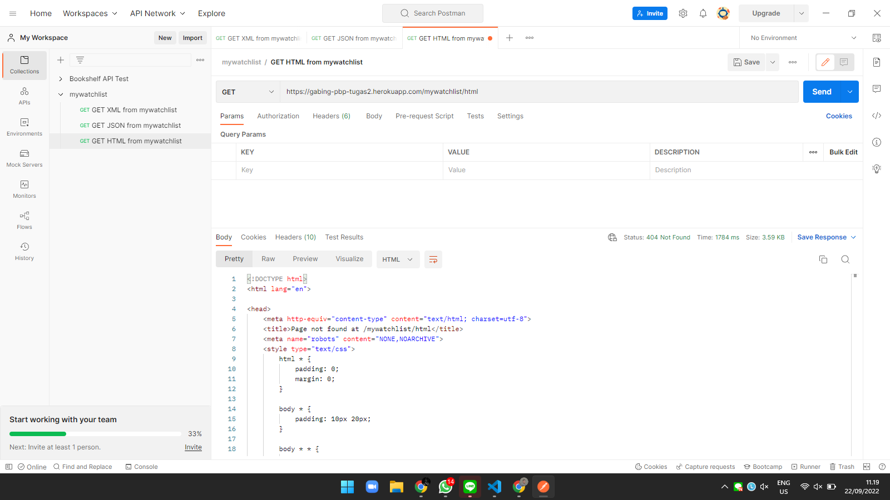

# Tugas 3 : Pengimplementasian Data Delivery Menggunakan Django

Pemrograman Berbasis Platform (CSGE602022) - diselenggarakan oleh Fakultas Ilmu Komputer Universitas Indonesia, Semester Ganjil 2022/2023


## Creator
> Nama : Gabriel Zebaoth Krisopras Putra  
> 
> NPM : 2106751480
> 
> Kelas : PBP-D
## Output Tugas
Berikut adalah link hasil pengerjaan tugas saya
[Heroku Link](https://gabing-pbp-tugas2.herokuapp.com/mywatchlist/).

<br></br>
# **Perbedaan JSON, XML, dan HTML**
## **Apa itu JSON ?**
**JSON** atau ***JavaScript Object Notation***, adalah sebuah format data berbasis teks dengan mengikuti sintaks seperti layaknya objek JavaScript. JSON diperkenalkan di awal tahun 2000 oleh Douglas Crockford. JSON digunakan sebagai alat untuk pertukaran data: memuat dan menampilkan informasi ke web secara responsif, menukarkan data dari website lain, dan menukarkan data antar platform dengan JSON API. JSON mempunyai syntax yang cukup sederhana. JSON menyimpan data dalam format map dengan pasangan key dan value. Key harus berupa String, sedangkan value dapat diisi dengan data primitif JavaScript apapun. JSON juga dapat diubah ke dalam bentuk string sehingga data yang sedang ditukar dapat dipahami dengan mudah. Format JSON adalah sebagai berikut.

## **Apa itu XML?**
**XML** atau ***Extensible Markup Language*** adalah sebuah format untuk membantu proses penyimpanan dan pentransferan data. Format XML hampir mirip dengan HTML. Keduanya sama-sama menggunakan tag untuk mengenali sebuah value dari data. Tetapi, XML memungkinkan developer untuk membuat tagnya sendiri, tidak seperti HTML yang sudah baku dan paten. Dengan format ini, developer dapat mengirimkan atau saling menukar data antar sistem atau platform melalui layanan internet.

## **Apa itu HTML?**
**HTML** atau ***HyperText Markup Language*** adalah sebuah format yang digunakan untuk membuat website atau bisa dibilang HTML ini merupakan pondasi untuk memuat seluruh konten dari sebuah website. HTML biasanya disandingkan dengan CSS (Cascading Style Sheet) untuk “mempercantik” bagian-bagian web. Misalnya, kita bisa membuat tabel di website dengan menggunakan tag HTML dan kita bisa mengubah warna atau teks tabel tersebut dengan menggunakan CSS. HTML menggunakan “markup” untuk membubuhi keterangan teks, gambar dan konten lain untuk ditampilkan di browser Web.HTML menyediakan tag atau elemen khusus, seprti body, div, h1, h2, link, a, ul, th, tr, dan masih banyak lagi

## **Apa perbedaan dari JSON, XML, dan HTML?**
### **Perbedaan HTML dengan JSON dan XML**
HTML memiliki fungsi yang berbeda dengan JSON dan XML. HTML hanya digunakan untuk menampilkan data ke sebuah website. HTML tidak dapat digunakan untuk menyimpan dan mengirim data antar sistem, platform, atau website seperti JSON dan XML. HTML juga bersifat statis karena fungsinya sendiri hanya untuk menampilkan data. HTML tidak dapat diuraikan atau di-parsed  dan digunakan oleh kebanyakan bahasa pemrograman tidak seperti JSON dan XML. 

### **Perbedaan JSON dan XML**
Meskipun JSON dan XML terlihat memiliki fungsionalitas yang sama tersebut tetapi keduanya memiliki karakteristik yang unik. Berikut adalah perbandingan antara JSON dengan XML.
| **Parameter**                     | **XML**                                                                         | **JSON**                                                                                             |
|-----------------------------------|---------------------------------------------------------------------------------|------------------------------------------------------------------------------------------------------|
| **Bahasa**                        | Sebuah markup dengan tag yang didefinisikan secara manual                       | Berupa formata dalam bentuk Objek JavaScript                                                         |
| **Penyimpanan data**              | Data disimpan sebagai tree structure                                            | Data disimpan sebagai map: ada key dan value.                                                        |
| **Pengolahan**                    | Dapat melakukan pemrosesan dan pemformatan dokumen dan objek                    | Tidak dapat melakukan pemrosesan dan perhitungan                                                     |
| **Jenis File**                    | Ukuran besar dan lambat saat parsing                                            | Ukuran besar dan cepat saat parsing                                                                  |
| **Dukungan Namespaces**           | Mendukung namespaces, komentar, dan metadata                                    | Tidak terdapat dukungan tersebut                                                                     |
| **Ukuran dokumen**                | Ukuran dokumen besar degnan struktur tag yang tidak readable                    | Human readable                                                                                       |
| **Jenis Tipe data yang didukung** | Mendukung bagan, charts, dan data non-primitif lain                             | JSON hanya berupa string, angka, boolean, objek, dan array dengan tidak mendukung data non-primitif  |
| **UTF**                           | Mendukung UTF-8 dan UTF-16                                                      | Mendukung UTF dan ASCII                                                                              |
| **Pengolahan data**               | Permintaan AJAX menjadi lambat karena bandwith untuk memproses tag sangat besar | Perminataan Ajak relatif cepat                                                                       |

<br></br>
# **Mengapa kita memerlukan *data* *delivery* dalam pengimplementasian sebuah platform ?**

Dalam mengimplementasikan sebuah platform,  kita sebagai developer pasti ingin membuat semua fungsionalitas dari platform dapat berfungsi dengan baik. Kita tahu bahwa fungsionalitas setiap komponen platform itu berfungsi adalah input (requests) dan output (responses) sinkron. Dalam sebuah web-platform, ada banyak komponen:
- Browser request HTML page, maka server juga harus mengembalikan HTML page.
- Browser request style sheet, maka server juga harus mengembalikan CSS file.
- Seterusnya berkalu untuk file JPG, JS, XML, JSON, dan data lainnya.

Peran data delivery inilah yang menjadi dasar sebuah platform dapat berjalan dengan baik. Tanpa adanya pengiriman data berupa HTML, maka browser milik client tidak dapat memuat informasi dan seluruh komponen dari website milik kita ke local network mereka.

<br></br>
# **Screenshots dari Postman**
## Test HTML URLs

## Test JSON URLs

## Test XML URLs


<br></br>
# **Penjelasan terkait Pengerjaan tugas**


## Konfigurasi Django App Baru "mywatchlist"
1. Membuka directory atau file dimana django-project berada
2.  Lalu, aktifkan virtual environment dengan mengetik perintah berikut.
      ```shell
      Windows:
      env\Scripts\activate.bat

      Unix (Linux & Mac OS):
      source env/bin/activate
      ```

3. Lalu, membuat sebuah django-app dengan nama "mywatchlist" dengan perintah berikut ```python manage.py startapp mywatchlist```
4. Tambahkan apliasi "mywatchlist" pada variabel INSTALLED_APPS di settings.py folder django-project. Langkah ini digunakan untuk mendaftarkan aplikasi mywatchlist agar dapat di baca oleh django.
      ```shell
      INSTALLED_APPS = [
         'events.apps.EventsConfig',
         'Django.contrib.admin',
         # tambahkan aplikasi disini
         'mywatchlist,'
      ]
   ```
<br></br>
## Membuat model "Watchlist" dan file "mywatchlist_data.JSON" 
1. Buka kembali directory django-app mywatchlist.
2. Kita akan membuat model watchlist dengan atribuat sebagai berikut.
   -  watched : BooleanField
   -  title : CharField, dengan maksimal character = 100
   -  rating : IntegerField
   -  release_date : CharField, dengan maksimal character = 100
   -  review : TextField
   Maka, models.py di mywatchlist menjadi seperti ini
   ```python
   from django.db import models
   from django.core.validators import MaxValueValidator, MinValueValidator 

   # Create your models here.
   class WatchList(models.Model):
      watched = models.BooleanField()
      title = models.CharField(max_length=100)
      rating = models.IntegerField(validators=[MinValueValidator(1), MaxValueValidator(5)])
      release_date = models.CharField(max_length=100)
      review =  models.TextField()
   ```
3. Langkah selanjutnya adalah melakukan migrasi data dari models kita agar attribute model kita tersimpan di django database. Untuk melakukan hal tersebut, kita perlu menjalankan perintah berikut.
   ```shell
   python manage.py makemigrations
   python manage.py migrate
   ```
4. Selanjutnya, kita akan membuat sebuah data sesuai dengan atribut pada model WatchList dan akan disimpan ke database django local. 
5. Selanjutnya, Buat folder ```fixtures``` di folder ```mywatchlist```. 
6. Lalu, Buat sebuah file ```mywatchlist_data.json``` di folder ```fixtures``` tersebut. Isi file tersebut dengan 10 data sebagai berikut.
   ```json
      [
      {
         "model": "mywatchlist.WatchList",
         "pk": 1,
         "fields": {
               "watched": true,
               "title": "Spiderman: No Way Home",
               "rating": 4,
               "release_date": "13 Juni 2021",
               "review": "Filmnya bagus, ada aksi dan ada lawaknya"
         }
      },
      {
         "model": "mywatchlist.WatchList",
         "pk": 2,
         "fields": {
               "watched": false,
               "title": "One Piece Film: Red",
               "rating": 4,
               "release_date": "13 September 2022",
               "review": "Untuk pertama kalinya, Uta - penyanyai paling dicintai akan mengungkapkan dirnya kepada dunia di konser langsungnya."
         }
      },
      {
         "model": "mywatchlist.WatchList",
         "pk": 3,
         "fields": {
               "watched": false,
               "title": "Miracle In Cell No 7",
               "rating": 5,
               "release_date": "20 Agustus 2022",
               "review": "Filmnya sedih bangettt :("
         }
      },
      {
         "model": "mywatchlist.WatchList",
         "pk": 4,
         "fields": {
               "watched": true,
               "title": "Pengabdi Setan 2",
               "rating": 5,
               "release_date": "23 Juli 2022",
               "review": "Filmya susah ditebak dan menegangkan"
         }
      },
      {
         "model": "mywatchlist.WatchList",
         "pk": 5,
         "fields": {
               "watched": true,
               "title": "Doctor Strange 2",
               "rating": 5,
               "release_date": "3 Mei 2022",
               "review": "Harus ngerti dulu serial marvel sebelumnya biar paham film ini."
         }
      },    {
         "model": "mywatchlist.WatchList",
         "pk": 6,
         "fields": {
               "watched": true,
               "title": "KKN di Desa Penari",
               "rating": 3,
               "release_date": "24 April 2022",
               "review": "Banyak Jumpscare 0_o"
         }
      },
      {
         "model": "mywatchlist.WatchList",
         "pk": 7,
         "fields": {
               "watched": true,
               "title": "Teka Teki Tika",
               "rating": 4,
               "release_date": "14 April 2021",
               "review": "Tidak sesuai ekspektasi"
         }
      },
      {
         "model": "mywatchlist.WatchList",
         "pk": 8,
         "fields": {
               "watched": true,
               "title": "Avanger",
               "rating": 5,
               "release_date": "20 Agustus 2020",
               "review": "Mantap Bet"
         }
      },
      {
         "model": "mywatchlist.WatchList",
         "pk": 9,
         "fields": {
               "watched": true,
               "title": "Iron Man",
               "rating": 4,
               "release_date": "20 Agustus 2018",
               "review": "Mantap boss Bagus Banget Loh"
         }
      },
      {
         "model": "mywatchlist.WatchList",
         "pk": 10,
         "fields": {
               "watched": true,
               "title": "Spiderman",
               "rating": 3,
               "release_date": "20 Agustus 2018",
               "review": "Aksinya mantap bet"
         }
      }
   ]
   ```
7.  Untuk membuat data tersebut tersimpan dalam database lokal. Jalankan perintah berikut ```python manage.py loaddata mywatchlist_data.json```.
8. Sekarang, kita sudah mengkonfigurasi bagian database atau models dari proyek django kita.

<br></br>
## Konfigurasi Views yang memetakan data dari models ke template HTML
1.  Pertama, kita akan membuka file ```views.py`` di folder ```mywatchlist```.
2.  Sebelumnya, kita perlu melakukan ```import``` modul-modul yang kita butuhkan.
   ```python
      # Tambahkan pada baris pertama views.py
      from django.shortcuts import render
      from django.http import HttpResponse
      from django.core import serializers
      from mywatchlist.models import WatchList
   ```
3. Untuk menampilkan data berupa HTML, kita akan membauat sebuah fungsi ```show_my_watch_list```. Adapun isi dari fungsi show_my_watch_list adalah sebagai berikut.
   ```python
   def show_my_watch_list(request):
      # Kita akan mngambil data dari models dan simpan ke watch_list_data
      watch_list_data = WatchList.objects.all()
      # BONUS: kita akan menghitung total data atau film yang sudah ditonton dan yang belum ditonton.

      # Untuk film yang ditonton kita ingin menghitung data dengan atribut watched bernilai True
      count_watched_film = WatchList.objects.filter(watched=True).count()
      # Berlaku sebaliknya pada unwatched film
      count_unwatched_film = WatchList.objects.filter(watched=False).count()

      # Variabel berikut bertipe boolean untuk mengecek apakah jumlah film yang ditonton lebih besar dari jumlah film yang belum ditonton atau tidak
      is_watched_greater_than_unwatched = count_watched_film > count_unwatched_film

      # Dictionary context memuat semua data yang akan dibutuhkan pada template html. Semua data dari database yang digunakan akan disimpan disini
      context = {
         'boolean_check': is_watched_greater_than_unwatched,
         'watch_list': watch_list_data,
         'nama': 'Gabriel Zebaoth Krisopras Putra',
         'student_id' : '2106751480',
      }

      return render(request, "my_watch_list.html", context)
   ```
4.  Selanjutnya, kita akan membuat sebuah fungsi yang akan mengembalikan file JSON dari database.
   ```python
      def show_json(request):
         data = WatchList.objects.all()
         return HttpResponse(serializers.serialize("json", data), content_type="application/json") 

      def show_json_by_id(request, id):
         data = WatchList.objects.filter(pk=id)
         return HttpResponse(serializers.serialize("json", data), content_type="application/json")
   ```
5.  Selanjutnya, kita akan membuat sebuah fungsi yang akan mengembalikan file XML dari database.
      ```python
      def show_xml(request):
         data = WatchList.objects.all()
         return HttpResponse(serializers.serialize("xml", data), content_type="application/xml")

      def show_xml_by_id(request, id):
         data = WatchList.objects.filter(pk=id)
         return HttpResponse(serializers.serialize("xml", data), content_type="application/xml")
      ```

## Membuat sebuah file HTML my_watch_list.html pada templates
1. Pertama, kita akan membuat folder template di dalam folder mywatchlist.
2. Selanjutnya, buatlah file my_watch_list.html.
3. Dalam file HTML tersebut, salin dan tempel code berikut.
   ```html
   

   

   <h1>Lab 2 Assignment PBP/PBD</h1>
   <h3>Get data from here:</h3>
   <a href="https://gabing-pbp-tugas2.herokuapp.com/mywatchlist/xml">Get XML Data</a> <br>
   <a href="https://gabing-pbp-tugas2.herokuapp.com/mywatchlist/json">Get JSON Data</a>

   <h5>Name: </h5>
   <p>{{nama}}</p>

   <h5>Student ID: </h5>
   <p>{{student_id}}</p>

   <!-- Key boolean_check dari context digunakan pada if else ini -->
   
      <h1>Selamat, kamu sudah banyak menonton!</h1>
   
      <h1>Wah, kamu masih sedikit menonton!</h1>
   
   <table>
      <tr>
         <th>Watched</th>
         <th>Title</th>
         <th>Rating</th>
         <th>Release Date</th>
         <th>Review</th>
      </tr>
       Add the data below this line 
      
         <tr>
               <th>{{movie.watched}}</th>
               <th>{{movie.title}}</th>
               <th>{{movie.rating}}</th>
               <th>{{movie.release_date}}</th>
               <th>{{movie.review}}</th>
         </tr>
      
   </table>
   
   ```


## Membuat sebuah routing untuk memetakan fungsi yang telah  dibuat pada views.py.
1. Membuka kembali folder mywatchlist.

2. Membuat urls.py untuk melakukan routing terhadap fungsi views yang telah dibuat sehingga nantinya halaman HTML dapat ditampilkan lewat browser. 
3. Pertama, kita aka mealkukan import fungsi views. Tambahkan kode berikut pada baris kedua urls.py
   ```python
   from mywatchlist.views import show_my_watch_list, show_json, show_json_by_id, show_xml, show_xml_by_id
   ```
4. Selanjutnya, kita menambahkan pat baru sesuai fungsi views masing-masing. Tambahkan kode berikut pada urls.py.
    ```python
   urlpatterns = [
      path('', show_my_watch_list, name='show_my_watch_list'),
      path('xml/', show_xml, name='show_xml'),
      path('json/', show_json, name='show_json'),
      path('json/<int:id>', show_json_by_id, name='show_json_by_id'),
      path('xml/<int:id>', show_xml_by_id, name='show_xml_by_id'),
   ]
    ```
5. Daftarkan juga aplikasi mywatchlist ke dalam urls.py yang ada pada folder ```project_django``` dengan menambahkan potongan kode berikut pada variabel urlpatterns.
   ```python
   ...
   path('mywatchlist/', include('mywatchlist.urls')),
   ...
   ```
6. Jalankan proyek Django dengan perintah python manage.py runserver dan bukalah http://localhost:8000/mywatchlist/ di browser untuk melihat halaman yang sudah dibuat.
<br></br>
## Membuat testing untuk mengecek apakah url respon HTTP 200 OK
1. Buka folder mywatchlist. Lalu, buka file test.py
2. Salin dan paste kode berikut.
   ```python
   from django.test import SimpleTestCase
   from django.urls import reverse, resolve
   from mywatchlist.views import show_my_watch_list, show_xml, show_json


   class Test_Data_Delivery_URLs(SimpleTestCase):
      def test_data_delivery_HTML(self):
         url = reverse('mywatchlist:show_my_watch_list')
         print(resolve(url))
         self.assertEqual(resolve(url).func, show_my_watch_list)
      def test_data_delivery_JSON(self):
         url = reverse('mywatchlist:show_json')
         print(resolve(url))
         self.assertEqual(resolve(url).func, show_json)
      def test_data_delivery_XML(self):
         url = reverse('mywatchlist:show_xml')
         print(resolve(url))
         self.assertEqual(resolve(url).func, show_xml)

   ```
3. Misal, muncul output diterminal : ```Ran 4 tests in 0.005s```. Tandanya testnya berhasil

<br></br>
## Melakukan deployment ke Heroku 
1. Coba jalankan proyek Django dengan perintah python manage.py runserver dan bukalah http://localhost:8000/mywatchlist/ di browser favoritmu untuk melihat halaman yang sudah kamu buat.
2. Cek apakah http://localhost:8000/mywatchlist/ dapat memuat template katalog.html dengan baik. Cek juga apakah data dari model dapat dirender oleh views  ke katalog.html.
3. Jika sudah benar, lakukanlah tahapan ```git add, commit, and push``` terhadap changes yang kamu lakukan.
4. Selanjutnya, folder atau repository proyek Django di akun github akan di deploy ke Heroku. Namun, ada beberapa hal yang harus diperhatikan.
5. Log-in ke halaman web Heroku.
6. Buka aplikasi yang digunakan untuk deployment repo tugas pbp ini.
7.   Kita akan melakukan deployment ulang denagn melakukan manual deployment.
8.   Tunggu proses deployment telah selesai.
9.   Untuk memastikan data di file json tertampilkan di website heroku. Jalankan perintah berikut ```python manage.py loaddata mywatchlist_data.json``` pada heroku console.
10.  Akhirnya! proyek Django sudah ter-*deploy* dengan baik di Heroku.

## Credits
Tugas ini dibuat dengan menggunakan template [PBP Ganjil 2021](https://gitlab.com/PBP-2021/pbp-lab) yang ditulis oleh Tim Pengajar Pemrograman Berbasis Platform 2021 ([@prakashdivyy](https://gitlab.com/prakashdivyy)) dan [django-template-heroku](https://github.com/laymonage/django-template-heroku) yang ditulis oleh [@laymonage, et al.](https://github.com/laymonage).

Made with <> by [gabiiing](https://github.com/gabiiing/)

