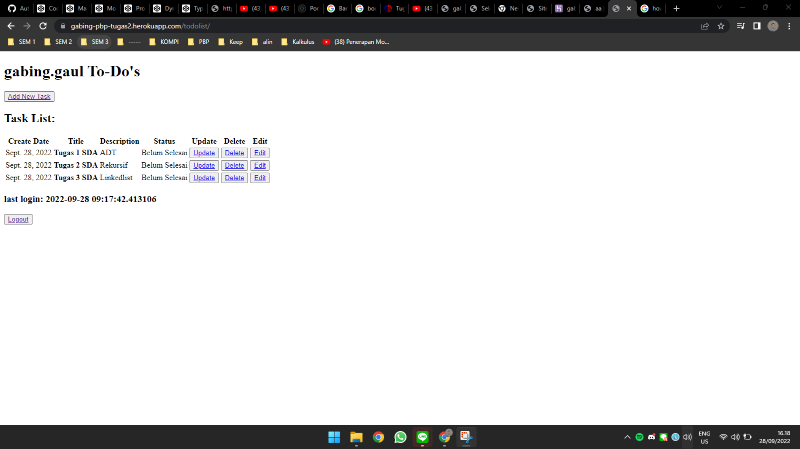

# Tugas 4 : Pengimplementasian Form dan Autentikasi Menggunakan Django

Pemrograman Berbasis Platform (CSGE602022) - diselenggarakan oleh Fakultas Ilmu Komputer Universitas Indonesia, Semester Ganjil 2022/2023


## Creator
> Nama : Gabriel Zebaoth Krisopras Putra  
> 
> NPM : 2106751480
> 
> Kelas : PBP-D
## Output Tugas
Berikut adalah link hasil pengerjaan tugas saya
[Heroku Link](https://gabing-pbp-tugas2.herokuapp.com/todolist/).

## Akun Dummy
> username: ```gabiiing``` password: ```gabing.gaul```
> 
> username: ```gabing.gaul``` password: ```gabriel.zebaoth```
# **Jawaban pertanyaan**
### **Apa kegunaan  pada elemen ```<form>```?**
```Cross-Site Request Forgery``` adalah sebuah serangan yang memanfaatkan user yang terautentikasi di sebuah website untuk mengirimkan permintaan ke server dengan maksud mencuri data. Jika penyerang berhasil mengakses akun superuser atau admin, maka database website tersebut tidak aman lagi alias tercuri.Django mempunyai cara untuk mengatasi serangan tersebut. Django memiliki . Baris ini akan menghasilkan token di server-side saat merender halaman template dan selalu memastikan dengan memeriksa token dari permintaan yang masuk. Suatu request akan divalidasi, jika token dari request tersebut valid, maka request akan direspon.

### **Apa yang terjadi apabila tidak ada potongan kode tersebut pada elemen ```<form>```?**
Website kita akan rentan akan serangan CSRF. Padahal, jenis serangan ini adalah serangan yang sangat umum. Dengan demikian, penyerang akan sangat mudah mengintai dan mencuri informasi yang didatabase website kita. Jika dengan teknik CSRF penyerang memperoleh akses superuser aplikasi django kita, maka website kita akan pada kendali penyerang tersebut. Selain itu, request kita juga mungkin akan ditolak karena django hanya merespon request dengan token yang valid.

### **Apakah kita dapat membuat elemen```<form>``` secara manual (tanpa menggunakan generator seperti {{ form.as_table }})? Jelaskan secara gambaran besar bagaimana cara membuat ```<form>``` secara manual.**
Selain kita menggunakan form.as_table / form.as_p / form.as_ul, kita ```bisa``` menggunakan tag ```<form></form>``` html dengan tambahan kode tertentu. Namun, kita perlu membuat file baru, yaitu forms.py. Forms ini akan kita gunakan untuk membuat custom form sesuai dengan field yang sudah kita buat pada model. Sesuadah membuat form, kita membuat sebuah file html berisi template html seperti biasa. Didalamnya kita buat tag ```<form>```. Isi attribute method dengan 'POST'. Jangan lupa untuk menambahkan . Lalu, untuk membuat masing-masing fields yang akan diisi untuk membuat item dari model yang ada di django, kita hanya perlu membuat div. Didalam div,tambahkan label untuk memberikan judul disamping kolom field yang tersedia. Diluar label, tambahkan ```{{ form.(field_model) }}```. Field model tersebut dapat disesuaikan dengan attribute atau fields yang sudah dibuat pada models.py.

### **Jelaskan proses alur data dari submisi yang dilakukan oleh pengguna melalui HTML form, penyimpanan data pada database, hingga munculnya data yang telah disimpan pada template HTML.**
1. Pengguna memasukkan input ke field form yang dibuat di aplikasi django. 
2. Ketika pengguna dapat menekan tombol ```submit```. Tombol submit tersebut akan mengirimkan request ```POST```. Request tersebut merujuk pada suatu path di URLs. Kemudian, URLs menjalankan fungsi views yang sesuai.
3. Pada fungsi ```views```, terdapat sebuah pengecekan lagi. Pertama, input akan dicek apakah valid atau tidak dengan menggunakan fungsi ```forms.is_valid()```, jika belum valid request masih ditolak. Jika valid, form akan membuat sebuah inctance dari models. Instance tersebut, akan disave ke database dengan fungsi ```forms.save()```. 
4. Sekarang, kita sudah mempunyai satu instance data dari model atau database yang dibuat. Data tersebut akan berada pada section ```nama-app``` > ```nama-model```
5. Untuk mengambil data dari database, kita perlu menambahkan variabel pada context di views. Untuk mendapat sejumlah ```queryset``` kita dapat menambahkan baris kode berikut.
   - ```NamaModels.objects.all()``` --> untuk mengambil semua data
   - ```NamaModels.objects.filter(namaAttribute=value)``` --> untuk mengambil sejumlah data dengan filter tertentu
   - ```NamaModels.objects.get(namaAttribute=value)``` --> untuk megambil sebuah data yang memiki attribute berisi value.
6. Agar database dapat tampil di html atau template, kita perlu menambahkan syntax {{namaVariabel}}. Jika kita ingin menampilkan banyak data. Kita bisa menggunakan perintah ```{{for item  in namaVariabel }} {{item.attribute1}} {{item.attribute2}}``` dst. Juga, masih banyak syntax django template yang lain


<br></br>
# **Penjelasan terkait Pengerjaan tugas**

- [x] Membuat suatu aplikasi baru bernama todolist di proyek tugas Django yang sudah digunakan sebelumnya.
    1.  Menjalankan perintah ```python manage.py startapp todolist```
    2.  Tambahkan apliasi "mywatchlist" pada variabel INSTALLED_APPS di settings.py folder django-project. Langkah ini digunakan untuk mendaftarkan aplikasi mywatchlist agar dapat di baca oleh django.
        ```python
        INSTALLED_APPS = [
            'events.apps.EventsConfig',
            'Django.contrib.admin',
            'katalog',
            'mywatchlist',
            # tambahkan aplikasi disini
            'todolist'
        ]
        ```
- [x] Menambahkan path todolist sehingga pengguna dapat mengakses http://localhost:8000/todolist.
    1. Membuat folder template. Kemudian, buat```todolist.html``` di dalam folder tersebut dengan berisi code berikut.
        ```html
        
        
        <title>Todolist</title>
        

          
            <head>
                
            </head>
            <body>
                <h1>Test</h1>
            </body>

        
        ```
    2. Membuat fungsi views ```show_todolist``` untuk menampilkan template html tersebut ke ```{{url}}/todolist/```. Salin dan Tempel kode berikut pada ```todolist/views.py```
        ```python
        def show_todolist(request):
            context = {}
            return render(request, 'todolist.html', context)
        ```

    3. Memetakan fungsi views dan html tersebut ke urls.py agar dapat ditampilkan di website. Pada urls.py tempel dan salin kode berikut.
        ```python
        from django.urls import path
        from todolist.views import show_todolist
        #sesuaikan dengan nama fungsi yang dibuat

        app_name = 'todolist'

        urlpatterns = [
            path('', show_todolist name='show_todolist' ),         
        ]

        ```
   
    4. Setelah itu, daftarkan urls todolist pada urlpatterns di project_django URL.
        ```python
        from django.contrib import admin
        from django.urls import path, include

        urlpatterns = [
            path('admin/', admin.site.urls),
            path('', include('example_app.urls')),
            path('katalog/', include('katalog.urls')),
            path('mywatchlist/', include('mywatchlist.urls')),
            # tambahkan path todolist/ yang mengarah pada urls path yang ada diaplikasi todolist
            path('todolist/', include('todolist.urls')),
        ]
        ```
   

- [X] Membuat sebuah model Task yang memiliki atribut sebagai berikut:
    - id berupa foreignkey yang diisi secara otomatis sebagai penanda dari masing-masing tugas yang dibuat
   - user untuk menghubungkan task dengan pengguna yang membuat task tersebut.
   - date untuk mendeskripsikan tanggal pembuatan task.
   - title untuk mendeskripsikan judul task.
   - description untuk mendeskripsikan deskripsi task
   - is_finished merupakan boolean yang menyatakan bahwa tugas tersebut ```Selesai``` atau ```Belum Selesai```.
    1. Buka folder aplikasi ```todolist```
    2. Lalu, buka models.py. Selanjutnya, kita akan membuat sebuah class Task sesuai dengan ketentuan tersebut.
        ```python
        from django.db import models
        from django.contrib.auth.models import User
        # Berguna untuk default value dari date
        from  django.utils import timezone

        class Task(models.Model):
            id = models.AutoField(primary_key=True)
            user = models.ForeignKey(User, default=None, on_delete=models.CASCADE);
            date = models.DateField(default = timezone.now);
            title = models.CharField(max_length=255);
            description = models.TextField();
            is_finished = models.BooleanField(default=False);

            def __str__(self) :
                return self.title
        ```
    3. Agar model tersebut dapat dirubah menjadi query database. Maka, kita akan melakukan migrasi di terminal dengan perintah ```python manage.py makemigrations```. Lalu, jalankah pula ```python manage.py migrate```

 - [x]  Mengimplementasikan form registrasi, login, dan logout agar pengguna dapat menggunakan todolist dengan baik.
    > ```Registrasi```
    1. Buka views.py. Import module agar views yang dibuat tetap berjalan
        ```python
        from django.shortcuts import redirect
        from django.contrib.auth.forms import UserCreationForm
        from django.contrib import messages 
        ```
    2. Membuat fungsi register pada todolist/views.py
        ```python
        def register(request):
            form = UserCreationForm()

            if request.method == "POST":
                form = UserCreationForm(request.POST)
                if form.is_valid():
                    form.save()
                    messages.success(request, 'Akun telah berhasil dibuat!')
                    return redirect('todolist:login')
            
            context = {'form':form}
            return render(request, 'register.html', context)
        ```
    3. Membuat template register.html
        ```html
        

        
        <title>Registrasi Akun</title>
        

          

        <div class = "login">
            
            <h1>Formulir Registrasi</h1>  

                <form method="POST" >  
                      
                    <table>  
                        {{ form.as_table }}  
                        <tr>  
                            <td></td>
                            <td><input type="submit" name="submit" value="Daftar"/></td>  
                        </tr>  
                    </table>  
                </form>

              
                <ul>   
                      
                        <li>{{ message }}</li>  
                          
                </ul>   
            

        </div>  

        
        ```
   
    > ```Login```
       
    1. Buka views.py. Import module agar views yang dibuat tetap berjalan
        ```python
        from django.contrib.auth import authenticate, login
        ```
    2. Membuat fungsi login pada todolist/views.py
        ```python
        def login_user(request):
            if request.method == 'POST':
                username = request.POST.get('username')
                password = request.POST.get('password')
                user = authenticate(request, username=username, password=password)
                if user is not None:
                    login(request, user)
                    return redirect('wishlist:show_wishlist')
                else:
                    messages.info(request, 'Username atau Password salah!')
            context = {}
            return render(request, 'login.html', context)
        ```
    3. Membuat template login.html
        ```html
        

        
        <title>Login</title>
        

        

        <div class = "login">

            <h1>Login</h1>

            <form method="POST" action="">
                
                <table>
                    <tr>
                        <td>Username: </td>
                        <td><input type="text" name="username" placeholder="Username" class="form-control"></td>
                    </tr>
                            
                    <tr>
                        <td>Password: </td>
                        <td><input type="password" name="password" placeholder="Password" class="form-control"></td>
                    </tr>

                    <tr>
                        <td></td>
                        <td><input class="btn login_btn" type="submit" value="Login"></td>
                    </tr>
                </table>
            </form>

            
                <ul>
                    
                        <li>{{ message }}</li>
                    
                </ul>
                 
                
            Belum mempunyai akun? <a href="">Buat Akun</a>

        </div>

        
        ```

    > ```Logout```
        
    1. Buka views.py. Import modul agar fungsi logout dapat berjalan.
        ```python
        from django.contrib.auth import logout
        ```
    2. Membuat fungsi logout di todolist/views.py
        ```python
        def logout_user(request):
            logout(request)
            return redirect('wishlist:login')   
        ```

 - [x] Membuat fitur ```show_todolist```, ```create_task```,```update_task```, ```update_task```, dan ```edit_task```
    1. ```show_todolist``` ----> Sebelum membuat halaman todolist.html memenuhi persyaratan diatas. Kita perlu mengatur fungsi show_todolist di views.py. Kita akan ambil data dari model Task, untuk menampilkan task masing-masing user. Kita juga akan atur bahwa views tersebut dapat digunakan ketika user sudah login. Selain itu, kita juga akan menggunakan cookies untuk menampilkan kapan user X terakhir login ke website kita. Buat fungsi show_todolist seperti berikut ini.
        ```python
        # client dapat mengakses fungsi ini -> todolist.html harus login terlebih dahulu
        @login_required(login_url='/todolist/login/')
        def show_todolist(request):
            # mengambil data tugas dari user yang login
            task_list = Task.objects.filter(user = request.user)
            context = {
                'task_list': task_list,
                # mengambil data user yang
                'last_login': request.COOKIES['last_login']
            }
            return render(request, 'todolist.html', context)
        ```
    2. Agar fitur menampilkan waktu login berhasil kita perlu rubah sedikit bagian fungsi login_user di views.py. Ganti bagian ```if user is not none``` menjadi seperti ini.
        ```python
        ...
        if user is not None:
            login(request, user) # melakukan login terlebih dahulu
            response = HttpResponseRedirect(reverse("wishlist:show_wishlist")) # membuat response
            response.set_cookie('last_login', str(datetime.datetime.now())) # membuat cookie last_login dan menambahkannya ke dalam response
            return response
        ...
        ```
    3. ```Tambah tugas``` ---->  Pertama, kita akan buat file form.py dengan menggunakan syntax dari django. Tambahkan kode berikut pada file tersebut.
        ```python
        from django.forms import ModelForm
        from todolist.models import Task

        class CreateTask(ModelForm):
            class Meta:
                model = Task
                # Form hanya meminta input title dan description
                fields = ['title', 'description' ]
        ```

    4. Langkah terkahir, kita akan membuat fungsi create_task di views. Fungsi tersebut harus berjalan ketika user logged in.
        ```python
            # Harus lgoin terlebih dahulu
            @login_required(login_url='/todolist/login/')
            def create_task(request):
                form = CreateTask()
                if request.method == 'POST':
                    form = CreateTask(request.POST, request.FILES)
                    # Ketika field dari setiap form sudah terisi dengan baik
                    if form.is_valid():
                        # akan dibuat dan disimpan data task ke database
                        task = form.save(commit=False)
                        # attribute user dari task tersebut merupakan task yang sudah login(request.user)
                        task.user = request.user
                        task.save()
                        return redirect('todolist:show_todolist')
                else:
                    form = CreateTask(initial={'user': request.user})
                context = {'form': form}
                return render(request, 'create_task.html', context)
        ```
    5. ```update_task``` ----> kita hanya perlu membuat fungsi update_task pada views.py.
        ```python
        @login_required(login_url='/todolist/login/')
        # Fungsi untuk memperbarui status task
        def update_task(request, pk):
            # parameter pk diperoleh dari url. kemudian akan dicari task dengan attribute id tersebut
            updated_task = Task.objects.get(id=pk)
            
            # attribut is_finished akan diupdate dengan menegeasi valuenya
            if updated_task.is_finished:
                updated_task.is_finished = False
            else:
                updated_task.is_finished = True
            
            updated_task.save() 
            return redirect("todolist:show_todolist")
        ```
    6.  ```delete_task``` ----> kita hanya perlu membuat fungsi delete_task pada views.py
        ```python
        @login_required(login_url='/todolist/login/')
        # Fungsi untuk memperbarui status task
        def delete_task(request, pk):
            # Task dicari dengan Id = pk. Lalu, didelete
            delete_task = Task.objects.get(id=pk)
            delete_task.delete() 
            return redirect("todolist:show_todolist")
        ```
    7.  ```edit_task``` ----> kita hanya perlu membuat fungsi edit_task pada views.py
        ```python
        @login_required(login_url='/todolist/login/')
        # Fungsi untuk memperbarui status task
        def edit_task(request, pk):
            task = Task.objects.get(id=pk)
            # akan membuka kembali form CreateTask() yang telah diisi berdasarkan attribut pada task dengan id = pk
            form = CreateTask(instance=task)
            # fungsionalitas selanjutnya sama seperti create_task
            if request.method == 'POST':
                form = CreateTask(request.POST, instance=task)
                if form.is_valid():
                    task = form.save(commit=False)
                    task.user = request.user
                    task.save()
                    return redirect('todolist:show_todolist')
            context = {'form': form}
            return render(request, 'create_task.html', context)
        ```
 - [x]  Membuat halaman utama todolist yang memuat username pengguna, tombol Tambah Task Baru, tombol logout, serta tabel berisi tanggal pembuatan task, judul task, dan deskripsi task.
    
    1.  Selanjutnya, kita akan membuat tampilan HTML sesuai dengan requirements yang ditentukan. Untuk detail masing-masing bagian, ada komen yang tertulis di masing-masing fitur yang disyaratkan.
        ```html
        
        
        <title>{{user.username}} Todolist</title>
        <h1>{{user.username}} To-Do's</h1>
        

          
            <head>
                
            </head>
            <!-- Button untuk membuat tugas Bary -->
            <button><a href="">Add New Task</a></button>

            <h2>Task List:</h2>
            <table>
                <tr>
                <!-- membuat header table-->
                <th>Create Date</th>
                <th>Title</th>
                <th>Description</th>
                <th>Status</th>
                <th>Update</th>
                <th>Delete</th>
                <th>Edit</th>
                </tr>
                 Add the data below this line 
                <!-- Mengiterasi data tugas pada query database -->
                
                    <tr>
                        <td>{{task.date}}</td>
                        <th>{{task.title}}</th>
                        <td>{{task.description}}</td>
                        <td> 
                            <!-- Jika is_finished true: tugas Selesai dan vice versa -->
                            
                            Selesai
                            
                            Belum Selesai
                            
                        </td>
                        <!-- Implementasi fungsi diviews pada button html disetiap task -->
                        <!-- Kegunaan task.id adalah untuk mengupdate data task dengan id tersebut -->
                        <!-- Task.id akan digunakan sebagai parameter pk di fungsi update, delete, dan edit di views.py -->
                        <td><button><a href="">Update</a></button></td>
                        <td><button><a href="">Delete</a></button></td>
                        <td><button><a href="">Edit</a></button></td>
                    </tr>
                
            </table>
            <!-- Implementasi last login -->
            <h3>last login: {{last_login}}</h3>
            <button><a href="">Logout</a></button>

        
        
        ```

 - [x]  Membuat halaman form untuk pembuatan task. Data yang perlu dimasukkan pengguna hanyalah judul task dan deskripsi task.
    1.  Selanjutnya, kita akan membuat sebuah page baru dengan membuat file create_task.html
        ```html
        
        
        <form action="" method="POST">
            
            <h1>Tambah Tugas Baru</h1>
            <table>
                {{form}}
                <tr>
                    <td></td>
                    <td> <input type = "submit" name="submit"> </td>
                </tr>
                
            </table>
        
        </form>

        
        ```
 - [x]  Membuat routing sehingga beberapa fungsi dapat diakses melalui URL berikut:
    -  http://localhost:8000/todolist berisi halaman utama yang memuat tabel task.
    -  http://localhost:8000/todolist/login berisi form login
    -  http://localhost:8000/todolist/register berisi form registrasi akun.
    -  http://localhost:8000/todolist/create-task berisi form pembuatan task
    -  http://localhost:8000/todolist/logout berisi mekanisme logout.
    -  http://localhost:8000/todolist/update-task/pk/ berisi mekanisme untuk mengganti status is_finished dari task dengan attribute id=pk.
    - http://localhost:8000/todolist/delete-task/pk/ berisi mekanisme untuk menghapus task dengan attribute id=pk.
    - http://localhost:8000/todolist/edit-task/pk/ berisi mekanisme untuk mengedit title dan description dari  task dengan attribute id=pk.

    Untuk membuat routing ke sejumlah alamat tersebut, kita perlu mengatur sejumlah path pada file urls.py. Berikut adalah kode pada file urls.py.
    ```python
    from django.urls import path
    from todolist.views import create_task, edit_task, register, login_user, logout_user,show_todolist, update_task, delete_task
    #sesuaikan dengan nama fungsi yang dibuat

    app_name = 'todolist'

    urlpatterns = [
        path('', show_todolist, name='show_todolist' ),
        path('register/', register, name='register'),
        path('login/', login_user, name='login'),
        path('logout/', logout_user, name='logout'),
        path('create-task/', create_task, name='create'),
        path('update-task/<int:pk>/', update_task, name='update'),
        path('delete-task/<int:pk>/', delete_task, name='delete'),
        path('edit-task/<int:pk>/', edit_task, name='edit'),
    ]
    ```
- [x] Melakukan deployment ke Heroku terhadap aplikasi yang sudah kamu buat sehingga nantinya dapat diakses oleh teman-temanmu melalui Internet.
  Untuk melakukan deployment ke heroku. Kita sebenarnya hanya melakukan ```git add```, ```git commit```, ```git push```. Heroku akan otomatis mengupdate data dari repository kita ke website atau aplikasi kita.
  Berikut adalah tampilan dari website heroku saya ketika sudah login.
  
- [x] Membuat dua akun pengguna dan tiga dummy data menggunakan model Task pada akun masing-masing di situs web Heroku.
  > ```User 1: gabing.gaul```
  

  > ```User 2: gabiiing```
  

- [x] Membuat sebuah README.md pada folder todolist yang berisi tautan menuju aplikasi Heroku yang sudah kamu deploy serta jawaban dari beberapa pertanyaan berikut
- [x] Melakukan Bonus
- Penjelasan terkait implementasi fitur update status tugas dan delete tugas. Serta, fitur tambahan saya sendiri. Terdapat pada bagian Membuat fitur ```show_todolist```, ```create_task```,```update_task```, ```update_task```, dan ```edit_task```

## Credits
Tugas ini dibuat dengan menggunakan template [PBP Ganjil 2021](https://gitlab.com/PBP-2021/pbp-lab) yang ditulis oleh Tim Pengajar Pemrograman Berbasis Platform 2021 ([@prakashdivyy](https://gitlab.com/prakashdivyy)) dan [django-template-heroku](https://github.com/laymonage/django-template-heroku) yang ditulis oleh [@laymonage, et al.](https://github.com/laymonage).

Made with <> by [gabiiing](https://github.com/gabiiing/)

